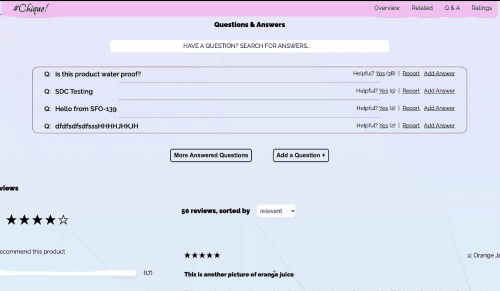

# Project #Chique! - Questions & Answers
by Wisdom Ibole  

The Q&A widget consists of two (2) main parts: a Search Bar and a List of Questions. The included features are implemented using, among other things, asynchronous functions, Axios, Express, React (hooks & classes), and CSS.

### Search Bar
The Search Bar allows a user to filter the list of questions by entering a keyword. Upon entering three (3) or more characters, filtering is initiated and only the questions matching said keyword(s) are displayed. Upon removal of the characters (less than three), all asked questions are once again displayed.

### List of Questions
Upon page load, four (4) or less questions are displayed in this section. A product with more than four questions will display only four on page load, with the option to show more questions (two at a time) at the push of a button. The displayed questions are sorted by helpfulness (how many prior users found it helpful). Questions can be reported: reported questions are no longer displayed on subsequent page loads.

Upon clicking a question, it reveals its answers. The answers are displayed two at a time with more being revealed at the push of a button. Answers are sorted by two criteria: i. Seller's answers are displayed first; ii. the most helpful answers are shown next.

Functionalities exist for adding questions and answers. The provided information is stored within the e-commerce's API. Adding an answer allows for images to be uploaded; these are stored in Cloudinary, an image-hosting API.
