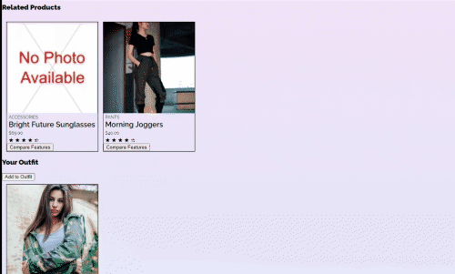

## Related Products
### Kavita Poduri  

The related products widget consists of two parts: a related-products carousel and a "Your Outfit" section. The carousel renders dynamically based on the current product ID, and each card sets the current product ID to the depicted product (which accordingly rerenders the whole page). Each card also has a button that compares the features of that product to the features of the main product displayed in the "Overview" section.

The "Your Outfit" section is a carousel consisting of products selected by the user; they're added by a button (functionality TBI). This list doesn't currently persist on reload, but could easily do so through the use of session cookies.
